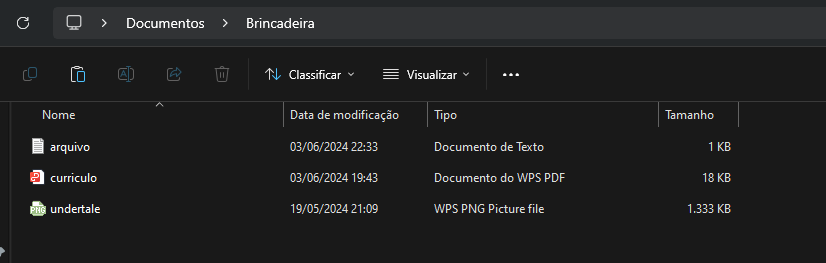
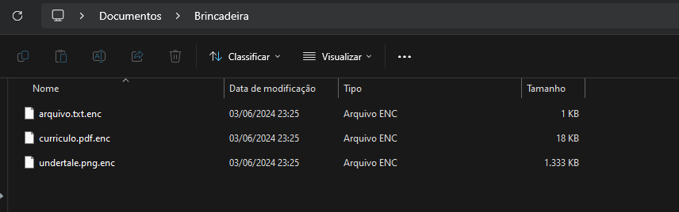
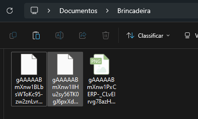

# Programas de Encriptação e Decriptação

## Visão Geral
Este repositório contém programas em Python para encriptar e decriptar arquivos utilizando o algoritmo AES (Advanced Encryption Standard). Além disso, permite gerar uma chave para encriptar os nomes dos arquivos. Se desejado, a chave também pode ser encriptada usando o algoritmo AES.

## Avisos
- Backup: Faça backup de arquivos importantes antes de usar estes programas, pois os arquivos serão alterados de forma irreversível.

## Pré-requisitos
- Python 3.x instalado
- Bibliotecas pycryptodome e tkinter

## Exemplo
Uma pasta com os seguintes arquivos: 
 

A mesma pasta após o algoritmo de encriptação. 
 

Tentativa de abertura do arquivo em pdf quando encriptado. 
 

Encriptação dos nomes. 
 

## Melhorias a Implementar
- Capturar e tratar erros de forma mais robusta
- Implementar limpeza de tela para uma interface mais clara
