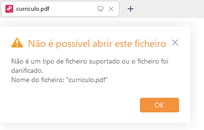

# Encryption and Decryption Program

## Overview
This repository contains Python programs to encrypt and decrypt files using the AES (Advanced Encryption Standard) algorithm. Furthermore, it allows you to generate a key to encrypt file names. If desired, the key can also be encrypted using the AES algorithm.

## Alerts
- Backup: Save important files before using these programs, as the files will be irreversibly changed.

## Prerequisites
- Python 3.x installed
- Pycryptodome and tkinter libraries

## Example
A folder with the following files: 
 

The same folder after the encryption algorithm. 
 

Attempt to open the pdf file when encrypted. 
 

Name encryption. 
 
